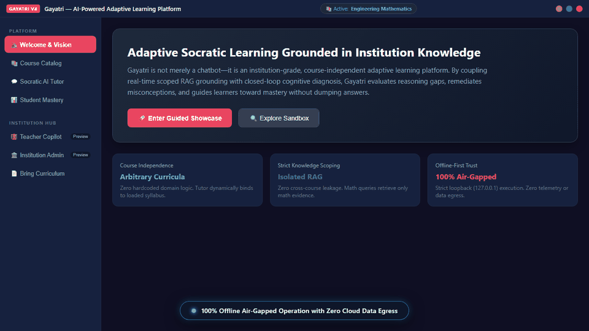
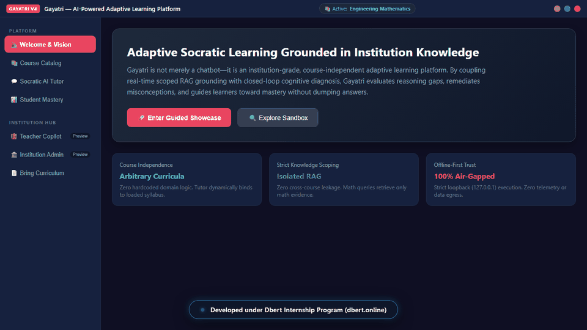
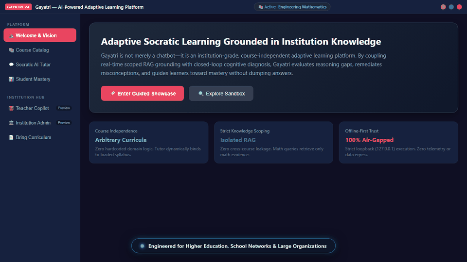

# Gayatri — AI-Powered Adaptive Learning Platform

  
  <h3>Course-Independent Socratic Tutoring Grounded in Institution Knowledge</h3>
  
<b>A Comprehensive Institutional Demonstration Release (v4.0.0)</b>

  
<i>This project has been developed under Dbert Internship Program. (<a href="https://dbert.online">dbert.online</a>)</i>

  

    
    
    
    
    
  

---

## 🌟 Executive Overview

**Gayatri is not merely a chatbot—it is an institution-grade adaptive learning platform.**

In higher education, generic cloud LLMs frequently fail students: they spoon-feed final answers, strip learners of cognitive struggle, leak sensitive data to the cloud, and lack grounding in university-specific curricula.

Gayatri solves this through localized, course-independent neural and symbolic intelligence:
- **Course-Agnostic Engine:** The core pedagogical orchestrator operates dynamically across distinct academic domains without hardcoded subject branches.
- **Strictly Scoped RAG Grounding:** Real-time retrieval matches only active course materials, guaranteeing zero cross-course data contamination.
- **Adaptive Socratic Pedagogy:** Guides students through analogies, graduated hints, and misconception diagnostics without premature answer disclosure.
- **Bring Your Curriculum:** Institutions can upload PDF, DOCX, or text notes to create instant custom knowledge sandboxes.
- **Absolute Data Sovereignty:** Operates 100% offline with strict loopback binding (`127.0.0.1`), zero telemetry, and zero cloud data egress.

---

## 📚 Included Demonstration Curricula

| Course Code | Course Title | Modules Included | Knowledge Scope | Status |
|---|---|---|---|---|
| **MATH201** | **Engineering Mathematics** | 4 Modules (ODEs, Laplace, Fourier, Linear Algebra) | 30+ Concept Cards & Formulas | **Primary Core** |
| **EC202** | **Digital Electronics** | 4 Modules (Number Systems, Boolean, Logic Gates, Flip-Flops) | 35+ Concept Cards & Truth Tables | **Primary Core** |
| **CHEM101** | **Senior Secondary Chemistry** | 2 Modules (Thermodynamics, Molecular Bonding) | Legacy NCERT Concept Cards | *Optional Showcase* |

---

## 🎥 Captioned Demonstration Walkthroughs

Three dedicated, high-definition (720p HD) demonstration videos with on-screen dynamic captions are provided for different institutional stakeholders:

---

### 1. 🎓 Core Platform & Adaptive Learner Walkthrough
*Designed for academic evaluators, curriculum committees, and students.*

  
  

    <b>Course-Independent Socratic Tutoring & Scoped RAG Grounding</b> 
    🎬 <a href="demo_video/gayatri_v4_platform_demo.webm"><b>View High-Definition Video (WebM — 3.89 MB)</b></a> | 
    ⬇️ <a href="https://raw.githubusercontent.com/Gayatri-Education/Gayatri-Demo/main/demo_video/gayatri_v4_platform_demo.webm"><b>Direct Raw Download</b></a> |
    ⚙️ <a href="scripts/record_demo_video.py"><b>Recording Script</b></a>
  

- **Key Highlights:** Real-time ODE inquiry, Retrieved Evidence Drawer citations, dynamic course switching to Digital Electronics with instant memory flush, and detection & remediation of the *NAND/NOR Logic Inversion Error*.

---

### 2. 👩‍🏫 Teacher Copilot & Faculty Walkthrough
*Designed for educators, professors, teaching assistants, and department heads.*

  
  

    <b>Classroom Intelligence, Cohort Health & Student Intervention Queue</b> 
    🎬 <a href="demo_video/gayatri_teacher_demo.webm"><b>View High-Definition Video (WebM — 3.22 MB)</b></a> | 
    ⬇️ <a href="https://raw.githubusercontent.com/Gayatri-Education/Gayatri-Demo/main/demo_video/gayatri_teacher_demo.webm"><b>Direct Raw Download</b></a> |
    ⚙️ <a href="scripts/record_teacher_demo.py"><b>Recording Script</b></a>
  

- **Key Highlights:** Class-level mastery tracking (42 students, 74.2% average), automated cohort misconception alerts (28% struggling with logic duality), student triage roster (identifying learners needing review before exams), Socratic anti-cheating scaffolding, and faculty note ingestion into local RAG.

---

### 3. 🏛️ Institution, School & Organization Governance Walkthrough
*Designed for university leadership, school boards, deans, CIOs, and compliance officers.*

  
  

    <b>Air-Gapped Topology, Data Sovereignty & Enterprise Knowledge Oversight</b> 
    🎬 <a href="demo_video/gayatri_institution_demo.webm"><b>View High-Definition Video (WebM — 3.47 MB)</b></a> | 
    ⬇️ <a href="https://raw.githubusercontent.com/Gayatri-Education/Gayatri-Demo/main/demo_video/gayatri_institution_demo.webm"><b>Direct Raw Download</b></a> |
    ⚙️ <a href="scripts/record_institution_demo.py"><b>Recording Script</b></a>
  

- **Key Highlights:** 100% Offline Air-Gapped Topology, strict loopback (`127.0.0.1`), zero outbound telemetry, multi-department course boundary enforcement, Microsoft Defender Clean PE binaries, and complete FERPA/DPDP data sovereignty.

---

## 🚀 Key Demonstration Flows

### 1. Course Independence & Context Isolation
Switch seamlessly from **Engineering Mathematics** to **Digital Electronics**. The tutor immediately updates its curriculum context and knowledge retrieval scope. Mathematical queries in Digital Electronics return 0 math cards, guaranteeing complete domain separation.

### 2. Adaptive Misconception Remediation
Test Gayatri with common student reasoning errors (e.g., *"For a NAND gate, the output is 0 when any input is 0"*). Rather than marking the answer wrong and revealing the test solution, Gayatri diagnoses the exact reasoning flaw (*NAND/NOR Logic Inversion Error*), explains the underlying principle, and presents a targeted Socratic reflection question.

### 3. Bring Your Curriculum (Document Ingestion Sandbox)
Upload custom syllabus notes or lecture handouts (PDF/DOCX/TXT). The platform extracts, sanitizes, and indexes atomic knowledge cards in under 5 seconds, making them immediately queryable by the Socratic tutor.

### 4. Institutional Visibility Previews
- **Teacher Copilot:** Inspect class-wide performance heatmaps, cohort misconception alerts, and targeted intervention recommendations.
- **Institution Admin:** View course catalog topology, knowledge base indexing health, and air-gapped security compliance metrics.

---

## 📦 Release Artifacts

| Deliverable | Description | Checksum (SHA-256) |
|---|---|---|
| `Gayatri_Adaptive_Learning_Platform_v4.0.0_Portable.zip` | Standalone portable bundle. Run `Gayatri_Launcher.bat` or `python -m app.main`. | Verified in `SHA256SUMS.txt` |
| `Gayatri_Adaptive_Learning_Platform_v4.0.0_Setup.exe` | Windows Inno Setup installer. Installs per-user without admin rights. | Generated via `scripts/build_demo.py` |

---

## 🛡️ Security, Privacy & Anti-Reverse Engineering Posture

- **Microsoft Defender Verified:** Clean scan completed on release distribution using `MpCmdRun.exe` (0 threats detected).
- **No Binary Packers (No UPX):** Standard PE executables prevent heuristic antivirus false positives.
- **Compiled PE Runtime:** All application logic is compiled into standalone native PE binaries; zero loose Python `.py` source code files are included in the distribution bundle.
- **Encapsulated Binary Curriculum Container:** Institutional syllabi, knowledge cards, and concept graphs are compiled and compressed into an obfuscated binary container (`courses.dat`), eliminating raw JSON card exposure.
- **Bytecode Stripping (-OO):** Python docstrings, assertions, and symbol annotations are stripped during release compilation.
- **Loopback Only:** Internal communication binds strictly to `127.0.0.1`, avoiding Windows Defender Firewall prompts.
- **SmartScreen Transparency:** New releases accumulate publisher reputation over time. Verify hashes via `SHA256SUMS.txt`.
- Complete audit report available in [`docs/SECURITY_AND_TRUST.md`](docs/SECURITY_AND_TRUST.md).

---

## 🎓 Program Attribution & Release Reference

This project has been developed under the **Dbert Internship Program** ([dbert.online](https://dbert.online)).

- **Authoritative Release Contract:** `DEMO_RELEASE_CONTRACT.md` (Commit: `eee87194be0e69fa0f11923d2a59869f0f215816`)
- **Release Documentation:** See [`RELEASE_NOTES_v4.0.0.md`](RELEASE_NOTES_v4.0.0.md) and [`INSTITUTION_DEMO_GUIDE.md`](INSTITUTION_DEMO_GUIDE.md).
- **Demonstration Walkthrough Video:** Available in [`demo_video/`](demo_video/).